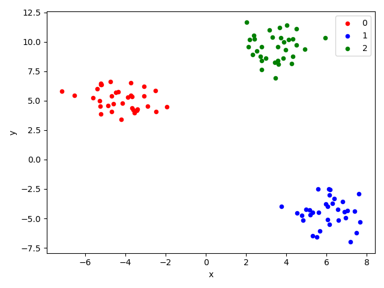
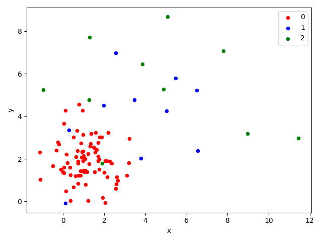

# 【sklearn用法详解】数据集生成1-各向同性的斑点状数据（make_blobs）

```python
from sklearn.datasets import make_blobs
```

> **各向同性的斑点状数据**
>
> 数据形态：各个类型的数据，都是以均值为中心，在各个维度上分布相同，且呈现正态分布。当数据为二维时，形似斑点状。
>
> 主要用途：监督学习的分类问题、无监督学习的聚类问题

## 参数说明

##### n_samples：以整型或整数列表表示的样本点数量（默认值=100）

* 【整型】参数值为样本点总数，每个类别的样本数由总数均分得到。
* 【列表】参数值为各个类别（有序）的样本点数量。

##### n_features：每个样本的特征数，即特征向量维度（默认值=2）

##### centers：以整型表示类别数量或以列表表示类别中心位置（默认值=None）

* 【None】自动生成类别数量，并随机生成类别中心位置：当n_samples为整型时，默认值None表示3；当n_samples为列表时，默认值None表示为n_samples列表的长度。
* 【整型】参数值为类别数量 ，随机生成类别中心位置：当n_samples为列表时，centers不能为整型。
* 【列表】参数值为各个列表（有序）的类别中心位置；当n_samples为列表时，centers的长度需与n_samples的长度一致。

##### cluster_std：以浮点数或浮点数列表表示的样本分布标准差（默认值=1.0）

* 【浮点数】参数值为所有类别共同的标准差。
* 【浮点数列表】参数值为各个类别（有序）的标准差；当n_samples为列表时，cluster_std的长度需要与n_samples的长度一致；当centers为整数时，cluster_std的长度需要与centers一致。

##### center_box：随机生成每个类别中心所在位置的范围（默认值=(-10.0, 10.0)）

##### shuffle：是否将样本随机排序（默认值=True）

##### random_state：随机数种子（默认值=None）

##### return_centers：是否将每个类别的中心作为第三个参数返回（默认值=False）

## 返回说明

##### 第1个返回值：所有样本点的特征向量

二维数组（numpy.ndarray）返回的所有样本点的特征向量。`X[i][j]`表示第i个样本点的第j个特征的值。样例如下：

```
array([[ 0.07265591, -0.81298618],
       [-4.65366319, -0.44305435],
       [-8.77594483, 13.16609774],
       [-5.11931955,  1.41511329],
       [-2.80460031, 12.89299425],
       [-1.11620992,  4.77121769],
       [ 0.3786011 ,  0.15604778],
       [-0.52112195,  0.32449985],
       [-4.08129882,  1.71145297],
       [-5.75589027, -0.80158723]])
```

##### 第2个返回值：所有样本点的所属类别

一维数组（numpy.ndarray）返回的所有样本点的所属类别。`y[i]`表示第i个样本点的类别。样例如下：

```
array([1, 0, 2, 0, 2, 2, 1, 1, 0, 0])
```

##### 第3个返回值：所有类别的中心位置（只有参数return_centers=True时才会返回）

二维数组（numpy.ndarray）返回的所有类别的中心位置。`centers[i][j]`表示第i个类别的第j个特征的值。样例如下：

```
array([[-4.93341374,  0.4559591 ],
       [ 0.07086377,  1.44169211],
       [-3.63493033,  8.95376589]])
```

## 调用实例

##### 默认参数



```python
make_blobs()
```

##### 设置类别样本点数量、类别中心位置、类别标准差



```python
make_blobs(n_samples=[80, 10, 10],
           centers=np.array([[1, 2], [3, 4], [5, 6]]),
           cluster_std=np.array([1, 2, 3]))
```

