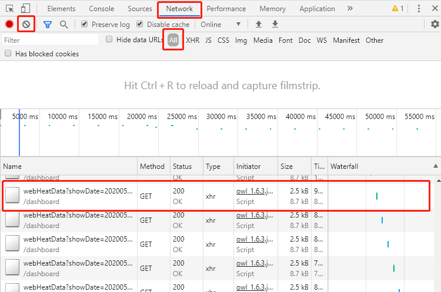

# Python数据采集案例(2)：猫眼电影实时票房采集

> **作者**：长行
>
> **时间**：2020.05.26

## 实现目标

本案例通过图文详细介绍网络请求和解析的方法，其目标实现的需求为：通过网络请求，获取猫眼中实时网播热度的数据，并打印到控制台中。

案例应用技巧：

* Ajax+Url参数分析
* GET请求(requests)
* Json解析

## 实现过程

总体来说，数据采集爬虫的实现过程包括如下步骤：

* 确定数据所在的Url
* 执行网页请求并解决请求中出现的问题
* 解析网页，获取格式化数据
* 存储数据（当前案例中不需要）

下面我们按着以上步骤来依次完成。

#### 确定数据所在Url

打开微博热搜榜，其Url为：http://piaofang.maoyan.com/dashboard/web-heat

打开网页后，我们发现网页上的数据每3秒左右会自动刷新一次，这说明数据并不是存在于网页源代码中，而是通过Ajax加载的。此时，我们可以打开浏览器控制台（快捷键为F12），进入Network选项卡。

Network选项卡中显示了浏览器所有请求的列表，Name为请求的Url，Type为请求的类型，下面我们就需要在请求列表中找到我们先清除历史请求（点击左上角灰色的禁止符），以便更容易地找到每次页面刷新时的请求。

> 本系列案例采集的一切数据仅可用于学习、研究用途！