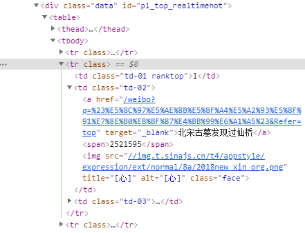

# Python数据采集案例(1)：微博热搜榜采集

> **作者**：长行
>
> **时间**：2020.05.25

## 实现目标

本案例通过图文详细介绍网络请求和解析的方法，其目标实现的需求为：通过网络请求，获取微博热搜榜中的前50条热搜的关键词，并将结果打印到控制台中。

案例应用技巧：

* GET请求(requests)
* HTML解析(BeautifulSoup4)

## 实现过程

总体来说，数据采集爬虫的实现过程包括如下步骤：

* 确定数据所在的Url
* 执行网页请求并解决请求中出现的问题
* 解析网页，获取格式化数据
* 存储数据（当前案例中不需要）

下面我们按着以上步骤来依次完成。

#### 确定数据所在Url

打开微博热搜榜，其Url为：https://s.weibo.com/top/summary


首先，我们需要判断目标数据是存在于页面上，还是通过Ajax加载的。我们可以在浏览器(建议使用Chrome浏览器)中右键，选择“查看网页源代码”。


此时浏览器会打开新的页面，其Url（网页地址）前增加了view-source部分，在网页中显示的关键词就是当前网页的源代码。


我们使用快捷键Ctrl+F打开搜索框，在网页源代码中搜索热搜榜页面上显示的文字，例如热搜排名第一的”北宋古墓发现过仙桥“，可以发现网页源代码中存在该关键词，这就说明热搜榜是直接加载在页面中，而不是通过Ajax加载的，此时我们只要直接请求网页的Url即可获得热搜榜数据。

#### 网页请求

下面我们使用requests模块执行网页请求，并打印请求的结果，其代码如下：

```python
import requests

if __name__ == "__main__":
    response = requests.get("https://s.weibo.com/top/summary")
    print(response.content.decode())
```

在打印出的内容中，我们再一次通过搜索找到了”北宋古墓发现过仙桥“，说明我们的请求成功获得了热搜榜数据，并没有出现任何问题。

#### 网页解析


再次回到浏览器，右键，选择“检查”，打开浏览器控制台（或直接使用快捷键F12也可以打开控制台）。


选中元素选取工具。


在元素选取模式下（元素选取工具的小箭头为蓝色），点击我们需要采集的信息。


此时，浏览器控制台将定位到目标信息所在的标签。


我们在该标签上右键，选择“Copy“，再选择”Copy Selector“，复制标签的CSS Selector路径，这个路径是用来定位到当前标签的。例如，第一条热搜关键词所在标签的CSS Selector为：

```
#pl_top_realtimehot > table > tbody > tr:nth-child(2) > td.td-02 > a
```

其中```#pl_top_realtimehot```表示ID为```pl_top_realtimehot```的标签，即下图中第一行的```div```标签；```> table```表示当前标签下一层的```table```标签，即下图中第二行的```table```标签；```tr:nth-child(2)```表示当前标签下的第二个```tr```标签，即下图中被选中的```tr```标签。



通过对于网络结构的观察，我们可以发现每条热搜都是tbody标签下的一个独立的tr标签；因此，要同时获取不同热搜的关键词，我们只需要不再限制指定的```tr```标签即可，即将CSS selector路径中```tr:nth-child(2)```中的```:nth-child(2)```删除即可。

```
#pl_top_realtimehot > table > tbody > tr > td.td-02 > a
```

在浏览器控制台的Elements标签中，使用Ctrl+F快捷键打开搜索框，在搜索框中搜索修改后的CSS Selector路径，可以得到51个结果，说明修改后的CSS Selector已经可以同时匹配所有热搜的关键词了。


下面我们使用Python的第三方模块——BeautifulSoup模块（pip安装命令 : pip install BeautifulSoup4）实现解析，包含请求的代码如下：

```python
import requests
from bs4 import BeautifulSoup

if __name__ == "__main__":
    response = requests.get("https://s.weibo.com/top/summary")
    bs = BeautifulSoup(response.content.decode(), 'lxml')
    for keyword_label in bs.select("#pl_top_realtimehot > table > tbody > tr > td.td-02 > a"):
        print(keyword_label.text)
```

（其中```select```函数为定位到标签；```text```属性为返回标签内的文字，可以简单地理解为可见内容）

运行结果已经可以将所有热搜打印到控制台中，实现了当前需求。

```
10个关键词把握2020中国经济走势
北宋古墓发现过仙桥
香港各界发起联署支持国家安全立法
马路惊现非洲雄狮
澳门所有大中小学升国旗唱国歌全覆盖
......
```

> 本系列案例采集的一切数据仅可用于学习、研究用途！
>
> 对于案例需求的说明 : 因此微博热搜榜是实时更新的，所以一个相对完整的采集需求如下：每3分钟采集一次微博热搜榜中的前49条热搜（忽略第3条的广告信息），并将结果存储到数据库中，数据库应至少包含采集时间、排名(rank)、关键词(keyword)、热度(hot)、类型(type)等字段。完整案例将在后续内容中讲解。
>
> 对于案例讲解的说明 : 作为第一个案例，本文通过图文详细讲解了每一个步骤，后续的案例将以讲解思路为主。
