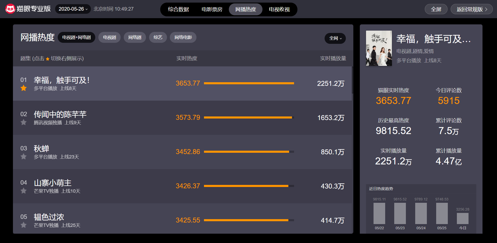
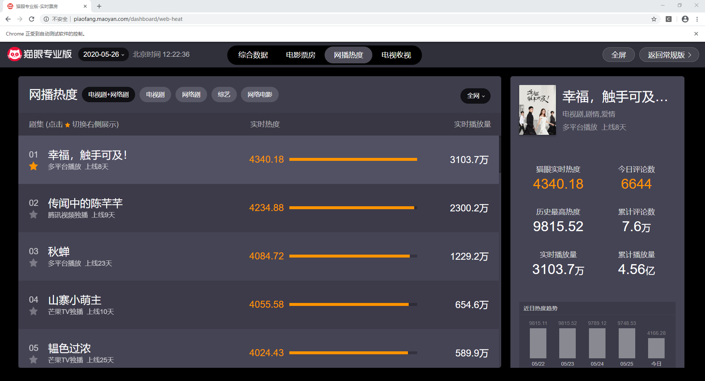

# Python数据采集案例(2)：Selenium实现的猫眼网播热度采集

> **作者**：长行
>
> **时间**：2020.05.26

## 实现目标

本案例通过图文详细介绍使用Selenium请求和解析网页方法，其目标实现的需求为：通过Selenium，获取猫眼中实时网播热度的数据，并打印到控制台中。

案例应用技巧：

* Selenium

>**Selenium安装方法**
>
>1. 通过pip安装selenium模块，安装命令：pip install selenium
>
>2. 下载与Chrome浏览器版本配套的chromedriver可执行文件，下载地址：http://npm.taobao.org/mirrors/chromedriver

## 实现过程

使用Selenium设计爬虫，不再解析Url并模拟真实请求；而是直接通过Selenium模拟浏览器操作，打开网页，解析数据即可。其具体实现流程如下：

首先，我们先用浏览器看一下我们的目标页面，对它有一个初步的认识。我们发现网页上的数据每3秒左右会自动刷新一次，这说明数据并不是存在于网页源代码中，而是通过Ajax加载的。因此，网页打开后，最好延迟1-2秒让网页有时间完成渲染。



接着，使用Selenium启动浏览器（在测试时不建议使用无头模式），并使用该浏览器打开Url：http://piaofang.maoyan.com/dashboard/web-heat

```python
import time
from selenium import webdriver
browser = webdriver.Chrome(executable_path=r"D:\Python38_64\chromedriver_81_0_4044_69.exe")  # ChromeDriver可执行文件的路径
browser.get("http://piaofang.maoyan.com/dashboard/web-heat")
time.sleep(1)
```

（大家在测试时可以使用IDLE或使用PyCharm的Python Console模式来测试，否则在代码运行完成后打开的浏览器也会被关掉）



下面，我们开始解析网页中的数据。使用浏览器控制台先定位到各个电视剧/网络剧的```<tr>```标签，然后再定位到这些标签内的排名、名称、信息（名称下的文字）、实时热度、实时播放量所在的标签，并将数据解析出来。

Selenium中常用定位方式如下：

| 方法名                        | 功能                            |
| ----------------------------- | ------------------------------- |
| find_element_by_id            | 依据标签ID定位标签，例如```<span id="A" class="BBB"> ```的ID为”A“ |
| find_element_by_class_name    | 依据标签的class属性定位标签，例如```<span id="A" class="BBB"> ```的class属性为”BBB“ |
| find_elements_by_css_selector | 依据标签的CSS选择器定位标签，例如```<span id="A" class="BBB"> ```的CSS选择器为”#A" |
| find_element_by_tag_name | 依据标签的标签名，例如```<span id="A" class="BBB"> ```的标签名为”span“ |
| find_elements_by_xpath | 依据标签的xpath定位标签，例如```<span id="A" class="BBB"> ```的xpath为“//*[@id="A"]” |

```python
for movie_label in browser.find_elements_by_css_selector(
            "#app > div > div > div.dashboard-content > div.dashboard-list.dashboard-left.bg > div.movielist-container > div > table > tbody > tr"):
    print("排名:", movie_label.find_element_by_class_name("moviename-index").text)
    print("名称:", movie_label.find_element_by_class_name("moviename-name").text)
    print("信息:", movie_label.find_element_by_class_name("moviename-info").text)
    print("信息:", movie_label.find_element_by_class_name("heat-text").text)
    print("信息:", movie_label.find_element_by_class_name("last-col").text)
```

（其中```find_element_by_class_name```方法为定位到标签；```text```属性为返回标签内的文字）

运行结果已经可以将前30名的网播热度打印到控制台中，实现了当前需求。

```
排名: 01
名称: 幸福，触手可及！
信息: 多平台播放  上线8天
信息: 4701.99
信息: 3565.2万
......
```

> 本系列案例采集的一切数据仅可用于学习、研究用途！