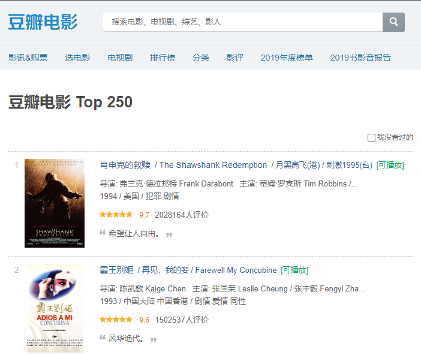
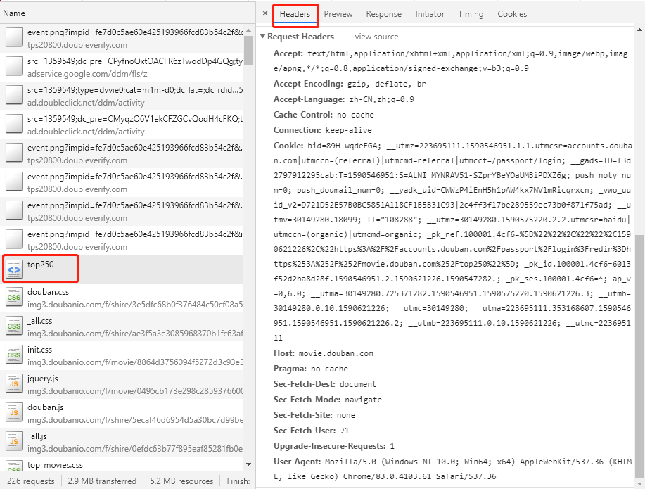

# Python数据采集案例(3)：豆瓣电影TOP250采集

> **作者**：长行
>
> **时间**：2020.05.28

## 实现目标

本案计划实现：通过网络请求，获取豆瓣电影TOP250的数据，并存储到Json文件中。

案例应用技巧：

* GET请求(requests)：headers
* 翻页
* 网页解析(BeautifulSoup)

## 实现过程

总体来说，简单的单线程爬虫的实现流程如下：

* 确定数据所在的Url，以及控制翻页的参数
* 执行网页请求并解决请求中出现的问题
* 解析网页，获取格式化数据
* 实现翻页
* 存储数据

下面我们按着以上步骤来依次完成。

#### 确定数据所在Url

在Chrome浏览器中打开豆瓣电影TOP250，其Url为：https://movie.douban.com/top250。



通过观察，可以发现目标数据是存在于网页源代码中的，直接请求网页Url即可获得。

同时，第1页仅显示了25部电影，说明我们需要请求10次不同的页面才能完成所有250部电影的抓取。于是我们在页面上点击打开第2页，发现第2页的Url是：

https://movie.douban.com/top250?start=25&filter=

相较于第1页的Url，第2页增加了start参数和filter参数，因为filter参数内容为空值，很可能是用来”我没看过的“选项的筛选的，因此start参数应该是实际起作用的。因为第1页有25个电影，而第2页的start参数为25，说明start很可能是指当前页面是从第多少部电影开始显示的。

为了检验这个结果，我们使用浏览器打开start参数值为0的页面，果然正确地打开了第1页。因此，我们只需要修改start参数就可以有效地实现翻页了。

#### 网页请求

下面我们开始尝试使用Python实现请求，在这个过程中，建议大家使用IDLE或PyCharm的Python Console模式来进行测试，减少网站的实际请求次数，以减少对目标网站的影响，以免被IP封锁。



我们先以第1页为例进行尝试，发现直接使用requests的请求并不能获得数据，说明我们的请求被拒绝了。因此，我们可以打开Chrome控制台中访问页面时的请求，选择headers选项卡，查看其中的Request Headers，并依据这个headers来伪装我们的请求。实现代码如下：

```python
import requests

headers = {
    "accept": "text/html,application/xhtml+xml,application/xml;q=0.9,image/webp,image/apng,*/*;q=0.8,application/signed-exchange;v=b3;q=0.9",
    "accept-language": "zh-CN,zh;q=0.9",
    "cache-control": "no-cache",
    "Connection": "keep-alive",
    "host": "movie.douban.com",
    "pragma": "no-cache",
    "Sec-Fetch-Dest": "document",
    "Sec-Fetch-Mode": "navigate",
    "Sec-Fetch-Site": "none",
    "Sec-Fetch-User": "?1",
    "Upgrade-Insecure-Requests": "1",
    "user-agent": "Mozilla/5.0 (Windows NT 10.0; Win64; x64) AppleWebKit/537.36 (KHTML, like Gecko) Chrome/79.0.3945.88 Safari/537.36",
}

response = requests.get("https://movie.douban.com/top250", headers=headers)

print(response.content.decode(errors="ignore"))
```

> 暂时先不要在headers中添加“Accept-Encoding”，否则请求结果可能会被压缩，影响解析。

在打印出的内容中，我们通过搜索可以找到我们需要的数据。

#### 网页解析

下面，我们使用CSS选择器将电影的各类信息解析出来（先定位到每个电影的标签，再定位到各类信息的标签，最后将各类信息从标签中提取出来）。在解析过程中，我们要随时考虑到我们当前解析的标签可能不存在，并努力避免因标签不存在而报错。实现代码如下：

```python
from bs4 import BeautifulSoup

bs = BeautifulSoup(response.content.decode(errors="ignore"), 'lxml')
for movie_label in bs.select("#content > div > div.article > ol > li"):  # 定位到电影标签
    url = movie_label.select_one("li > div > div.pic > a")["href"]  # 获取电影链接(<a>标签的href属性)
    title_text = movie_label.select_one("li > div > div.info > div.hd > a").text  # 获取标题行内容
    info_text = movie_label.select_one("li > div > div.info > div.bd > p:nth-child(1)").text  # 获取说明部分内容
    rating_num = movie_label.select_one("li > div > div.info > div.bd > div > span.rating_num").text  # 获取评分
    rating_people = movie_label.select_one("li > div > div.info > div.bd > div > span:nth-child(4)").text  # 获取评分人数
    if quote_label := movie_label.select_one("li > div > div.info > div.bd > p.quote"):
        quote = quote_label.text  # 获取评价
    print(url, title_text, info_text, rating_num, rating_people, quote)
```

通过以上代码，我们成功地将各部分的数据都解析出来了，但是解析出的标题行内容、说明部分内容、评分、评分人数和评价中格式相对混乱，包括很多不需要的内容，需要进一步的清洗。

解析、清洗标题行：

```python
title_text = movie_label.select_one("li > div > div.info > div.hd > a").text.replace("\n", "")  # 提取标题行内容+清除换行符
title_chinese = clear_space_in_polar(title_text.split("/")[0])  # 提取中文标题+清除前后空格
title_other = [clear_space_in_polar(title) for title in title_text.split("/")[1:]]  # 提取其他标题+清除前后空格
```

解析导演信息(因长度原因，大部分主演名字不全暂不解析)：

```python
info_text = movie_label.select_one("li > div > div.info > div.bd > p:nth-child(1)").text  # 获取说明部分内容
info_text = re.sub("\n *", "\n", info_text)  # 清除行前多余的空格
info_text = re.sub("^\n", "", info_text)  # 清除开头的空行
info_line_1 = info_text.split("\n")[0]  # 获取第1行内容信息:包括导演和主演
info_line_2 = info_text.split("\n")[1]  # 获取第2行内容信息:包括年份、国家和类型
director = re.sub(" *(主演|主\\.{3}|\\.{3}).*$", "", info_line_1)  # 仅保留导演部分
year = int(re.search("[0-9]+", info_line_2.split("/")[0]).group())  # 提取电影年份并转换为数字
country = clear_polar_space(info_line_2.split("/")[1]) if len(info_line_2.split("/")) >= 2 else None  # 提取电影国家
classify = clear_polar_space(info_line_2.split("/")[2]) if len(info_line_2.split("/")) >= 3 else None  # 提取电影类型
classify = re.split(" +", classify)  # 将电影类型转换为list形式
```

解析评分、评分人数和评价：

```python
# 解析评分
rating_num = movie_label.select_one("li > div > div.info > div.bd > div > span.rating_num").text  # 提取评分
rating_num = float(re.search("[0-9.]+", rating_num).group())  # 将评分转换为浮点型数字

# 解析评分人数
rating_people = movie_label.select_one("li > div > div.info > div.bd > div > span:nth-child(4)").text  # 提取评分人数
rating_people = int(re.search("[0-9]+", rating_people).group())  # 将评分人数转换为数字

# 解析评价(该标签可能会不存在)
if quote_label := movie_label.select_one("li > div > div.info > div.bd > p.quote"):
    quote = quote_label.text.replace("\n", "")  # 提取评价+清除换行符
else:
    quote = None
```

在解析的过程中，我们将每个电影解析的结果临时存储在循环前定义的movie_list列表中。

```python
movie_list.append({
    "title": {
        "chinese": title_chinese,
        "others": title_other
    },
    "director": director,
    "year": year,
    "country": country,
    "classify": classify,
    "rating": {
        "num": rating_num,
        "people": rating_people
    },
    "quote": quote
})
```

#### 实现翻页

在完成了单页面的解析后，我们开始实现翻页。根据之前对页面的了解，我们只需要将页面的请求和解析嵌套到一个循环中即可。在每次循环中均需进行延迟，以免请求频率过高。实现代码如下：

```python
import time
for page_num in range(10):
    url = "https://movie.douban.com/top250?start={0}&filter=".format(page_num * 25)
    response = requests.get(url, headers=headers)
    ......
    time.sleep(5)
```

#### 存储数据

最后，我们将存储在临时变量movie_list列表中的数据存储到本地Json文件（若使用IDLE或PyCharm的Python Console模式，建议使用绝对路径）。

```python
import json
with open("豆瓣TOP250电影.json", "w+", encoding="UTF-8") as file:
    file.write(json.dumps({"data": movie_list}, ensure_ascii=False))
```

> 本系列案例采集的一切数据仅可用于学习、研究用途！