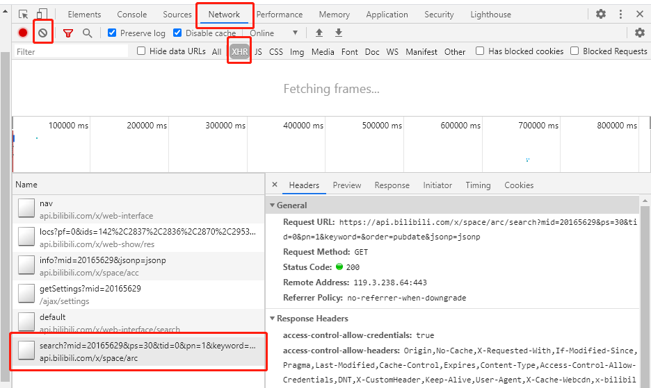
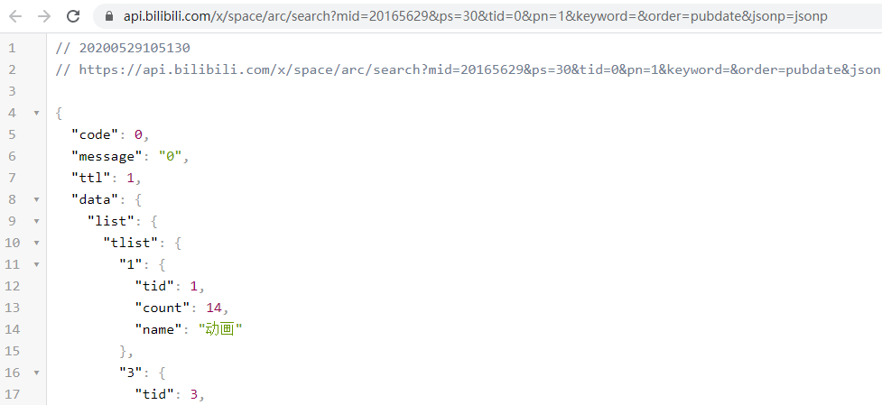

# Python数据采集案例(4)：B站UP主发布视频信息采集

> **作者**：长行
>
> **时间**：2020.05.29

## 实现目标

本案计划实现：通过网络请求，获取UP主发布的所有视频的信息（包括视频标题、视频播放次数），并输出到控制台。

【案例应用技巧】

* GET请求(requests)：headers
* 浏览器抓包(Chrome)
* 翻页
* Json解析(json)

## 实现过程

当前爬虫的实现流程如下：

* 确定数据所在的Url，以及控制翻页的参数
* 执行网页请求并解决请求中出现的问题
* Json解析
* 实现翻页

下面我们按着以上步骤来依次完成。

#### 确定数据所在Url

在Chrome浏览器中打开一个UP主的视频页面，以“共青团中央”为例，其Url为：https://space.bilibili.com/20165629/video。


通过观察，我们发现我们需要的信息并没有存在于网页源代码中，这说明是这些信息是通过Ajax加载的。

此时，我们可以打开Chrome浏览器的控制台（快捷键为F12），进入Network选项卡。



Network选项卡中显示了浏览器所有请求的列表，Name为请求的Url，Type为请求的类型，而我们就需要在请求列表中找到包含视频信息数据的请求。在寻找包含目标信息数据的请求时，我们可以通过如下操作来帮助我们更好地寻找：

* 点击左上角灰色的禁止符，清空请求列表，然后重新刷新页面（执行能够使目标数据发生变化的操作），进而方便我们的搜索范围；
* 依据类型筛选，其中常用的包括：XHR为文本格式内容、Js为javascript脚本、CSS为样式表、Img为图像、Media为视频；但是有的时候我们需要的数据并不一定会被分入对应的类型中，如果对应类型中没有找到，就不要筛选了；
* 可以参考目标数据被显示的时间，重点在显示时间点前后的时间范围内寻找。

在缩小范围后，我们发现找到```search?...```请求很可能就是包含视频信息的请求。为了验证目标数据是否在这个请求中，我们双击它，在打开的新页面中我们的确可以找到目标数据。



（安装Chrome的Json viewer插件后的显示结果如上图）

在这个请求中，Url包括如下参数（参数值以共青团中央账号第1页为例）：

```
mid = 20165629
ps = 30
tid = 0
pn = 1
keyword
order = pubdate
jsonp = jsonp
```

经过多次试验（选择不同标签、不同顺序、不同页面、不同UP主的多次尝试），我们发现：

* mid：UP主的ID，可以通过UP主主页的Url获得
* ps：当前页获取的视频数量
* tid：视频标签类型（0=全部、1=动画、3=音乐、4=游戏、5=娱乐、11=电视剧、23=电影、36=科技、119=鬼畜、129=舞蹈、155=时尚、160=生活、165=广告……）
* pn：当前页面数（从1开始计数）
* keyword：搜索关键词（默认为空）
* order：视频顺序（最新发布=pubdate、最多播放=click、最多收藏=stow）
* jsonp：未知作用，可当常量使用

因此，我们只需要修改pn，即可实现翻页。

#### 网页请求

以下过程建议大家使用IDLE或PyCharm的Python Console模式来进行测试，减少网站的实际请求次数，以减少对目标网站的影响，以免被IP封锁。

我们先以第1页为例进行尝试，使用headers来伪装我们的请求。实现代码如下：

```python
from urllib.parse import urlencode

import requests

headers = {
    "accept": "application/json, text/plain, */*",
    "accept-language": "zh-CN,zh;q=0.9",
    "cache-control": "no-cache",
    "origin": "https://space.bilibili.com",
    "referer": "https://space.bilibili.com/20165629/video",
    "pragma": "no-cache",
    "Sec-Fetch-Dest": "empty",
    "Sec-Fetch-Mode": "cors",
    "Sec-Fetch-Site": "same-site",
    "Upgrade-Insecure-Requests": "1",
    "user-agent": "Mozilla/5.0 (Windows NT 10.0; Win64; x64) AppleWebKit/537.36 (KHTML, like Gecko) Chrome/83.0.4103.61 Safari/537.36",
}  # Headers

param_dict = {
    "mid": 20165629,
    "ps": 30,
    "tid": 0,
    "pn": 1,
    "keyword": "",
    "order": "pubdate",
    "jsonp": "jsonp",
}  # 参数列表

response = requests.get("https://api.bilibili.com/x/space/arc/search?" + urlencode(param_dict), headers=headers)

print(response.content.decode(errors="ignore"))
```

（其中urlencode用于整理URL参数）

> 暂时先不要在headers中添加“Accept-Encoding”，否则请求结果可能会被压缩，影响解析。

在打印出的内容中，我们通过搜索可以找到目标数据，说明请求无误。

#### Json解析

通过观察，我们发现返回的结果为Json格式数据，观察Json数据格式后，我们使用如下方法解析其中视频的视频标题和播放次数，并输出到控制台：

```python
response_json = response.json()  # 将返回结果解析为Json格式
video_list = list()
    for video_item in response_json["data"]["list"]["vlist"]:  # 遍历视频信息
        video_title = video_item["title"]  # 标题
        video_play = video_item["play"]  # 播放次数
        print("标题:", video_title)
        print("播放次数:", video_play)
```

#### 实现翻页

在完成了单页面的解析后，我们开始实现翻页。根据之前对页面的了解，我们只需要不断修改参数列表中的pn即可实现翻页。同时，可以通过请求结果中返回的视频总数，来计算需要请求的页数。在每次循环中均需进行延迟，以免请求频率过高。实现代码如下：

```python
import time
import math

now_page = 1
max_page = 2
while now_page <= max_page:
    print("正在请求第", now_page, "页......")
    param_dict["pn"] = now_page  # 将当前页填入到参数列表中
    response = requests.get("https://api.bilibili.com/x/space/arc/search?" + urlencode(param_dict), headers=headers)
    response_json = response.json()  # 将返回结果解析为Json格式

    now_page += 1  # 页面累加
    max_page = math.ceil(response_json["data"]["page"]["count"] / 30)  # 获取UP主视频总数(用以控制翻页次数)
    
    ......
    
    time.sleep(5)
```

> 本系列案例采集的一切数据仅可用于学习、研究用途！

